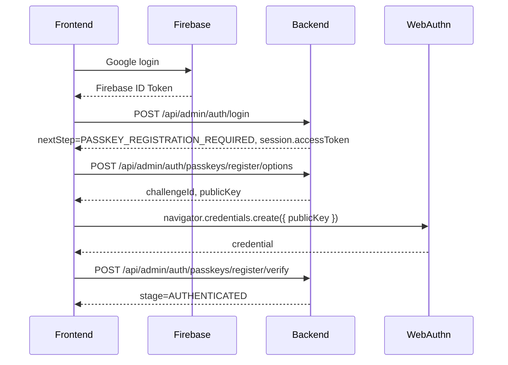
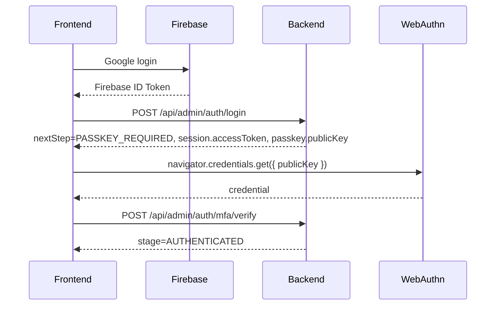

# Admin API Frontend Integration Guide

이 문서는 프론트엔드가 관리자 콘솔을 연동할 때 필요한 관리자 컨트롤러, DTO, 인증/패스키 흐름, 요청 파라미터, 응답 구조를 코드 기준으로 정리한 문서입니다.

기준 코드:

- `src/main/java/com/example/pogun/controller/admin/AdminAuthController.java`
- `src/main/java/com/example/pogun/controller/admin/AdminAuthLocalController.java`
- `src/main/java/com/example/pogun/controller/admin/AdminController.java`
- `src/main/java/com/example/pogun/dto/admin/**`
- `src/main/java/com/example/pogun/service/adminauth/**`
- `src/main/java/com/example/pogun/service/admin/AdminConsoleService.java`
- `src/main/java/com/example/pogun/config/SecurityConfig.java`
- `src/main/java/com/example/pogun/config/AdminSessionAuthenticationFilter.java`

## 1. 공통 규칙

### Base URL

환경별 API base URL은 배포 환경에 따라 달라질 수 있습니다.

| 환경 | 예시 |
|---|---|
| 로컬 백엔드 | `http://localhost:8081` |
| 운영 백엔드 | `https://paw.gbsw.hs.kr` |

관리자 API prefix는 아래와 같습니다.

| 영역 | Prefix |
|---|---|
| 관리자 인증 | `/api/admin/auth` |
| 로컬 관리자 인증 | `/api/admin/auth/local` |
| 관리자 콘솔 API | `/api/admin` |

### Content-Type

JSON 요청은 기본적으로 아래 헤더를 사용합니다.

```http
Content-Type: application/json
Accept: application/json
```

CSV 다운로드 API는 `Accept`를 따로 지정하지 않아도 서버가 CSV를 반환합니다.

### 공통 응답 래퍼

모든 JSON API는 `ApiResponse<T>` 형태로 응답합니다.

```json
{
  "ok": true,
  "status": 200,
  "message": "요청이 성공했습니다.",
  "data": {},
  "error": null,
  "meta": {
    "requestId": "req_1a2b3c4d5e6f",
    "timestamp": "2026-05-07T08:00:00Z"
  }
}
```

실패 응답은 아래 형태입니다.

```json
{
  "ok": false,
  "status": 401,
  "message": "관리자 세션이 필요합니다.",
  "data": null,
  "error": {
    "code": "ADMIN_SESSION_REQUIRED",
    "message": "관리자 세션이 필요합니다.",
    "detail": null
  },
  "meta": {
    "requestId": "req_1a2b3c4d5e6f",
    "timestamp": "2026-05-07T08:00:00Z"
  }
}
```

프론트에서는 HTTP status와 `ok`를 함께 확인하는 것이 안전합니다.

### 공통 에러 코드

| HTTP | code | 의미 | 프론트 처리 |
|---:|---|---|---|
| 400 | `VALIDATION_ERROR` | DTO 검증 실패 | `error.detail`의 필드별 메시지 표시 |
| 400 | `INVALID_JSON` | JSON body 파싱 실패 | 요청 body 직렬화 확인 |
| 400 | `MISSING_PARAMETER` | 필수 query/path 누락 | 입력값 확인 |
| 401 | `ADMIN_SESSION_REQUIRED` | 관리자 세션 없음/만료/잘못된 토큰 | 로그인 화면 또는 패스키 단계로 이동 |
| 401 | `INVALID_CREDENTIALS` | Google Firebase ID Token 검증 실패 | Google 재로그인 유도 |
| 403 | `ADMIN_ONLY` | 관리자 계정이 아님 | 접근 차단 안내 |
| 403 | `GOOGLE_SIGN_IN_REQUIRED` | Google 소셜 로그인이 아님 | Google 로그인만 허용 안내 |
| 403 | `ADMIN_PERMISSION_DENIED` | 필요한 관리자 권한 없음 | 권한 없음 표시 |
| 403 | `ADMIN_AUTH_STEP_INVALID` | 현재 세션 단계와 API가 맞지 않음 | `/api/admin/auth/session` 재확인 |
| 403 | `PASSKEY_INVALID` | 패스키 등록/검증 실패 | 패스키 재시도 |
| 403 | `PASSKEY_CHALLENGE_INVALID` | 챌린지 만료/사용됨/불일치 | options 재발급 |
| 404 | `USER_NOT_FOUND` | 사용자 없음 | 목록 갱신 |
| 404 | `NOTICE_NOT_FOUND` | 공고 없음 | 목록 갱신 |
| 500 | `INTERNAL_SERVER_ERROR` | 미처리 서버 오류 | requestId와 함께 문의/로그 확인 |

## 2. 관리자 인증 모델

관리자 인증은 일반 사용자 Firebase 인증과 별도입니다.

프론트에서 혼동하면 안 되는 토큰은 아래와 같습니다.

| 토큰 | 발급 주체 | 사용 위치 | 저장 여부 |
|---|---|---|---|
| Firebase ID Token | Firebase Web SDK | `POST /api/admin/auth/login` 요청 body | 필요 시 Firebase SDK가 관리 |
| Admin accessToken | 백엔드 `AdminSessionTokenService` | `/api/admin/**`, `/api/admin/auth/**` Authorization header | 프론트 세션 저장소에 저장 가능 |

관리자 API 호출 시 사용하는 헤더는 아래입니다.

```http
Authorization: Bearer {adminAccessToken}
```

`adminAccessToken`은 JWT가 아닙니다. 백엔드가 48바이트 랜덤 토큰을 생성하고, DB에는 SHA-256 hash만 저장합니다.

## 2-A. 관리자 세션 갱신

```http
POST /api/admin/auth/refresh
Authorization: Bearer {adminAccessToken}
```

동작:

- 현재 관리자 세션이 `AUTHENTICATED` 단계일 때 새로운 accessToken을 발급합니다.
- 기존 세션은 즉시 revoke 처리됩니다.

성공 응답 data는 `AdminAuthSessionResponse`입니다.

```json
{
  "accessToken": "new-admin-session-token",
  "expiresAt": "2026-05-07T10:00:00Z",
  "stage": "AUTHENTICATED",
  "admin": {
    "id": "uuid",
    "email": "admin@example.com",
    "name": "관리자",
    "role": "ADMIN"
  },
  "permissions": [
    "AUDIT_READ"
  ]
}
```

실패:

| status | code | 의미 | 프론트 처리 |
|---:|---|---|---|
| 401 | `ADMIN_SESSION_REQUIRED` | 세션 없음/만료 | 로그인 UI로 이동 |
| 403 | `ADMIN_AUTH_STEP_INVALID` | `AUTHENTICATED` 단계 아님 | 로그인/패스키 단계로 이동 |

### 세션 단계

`AdminSessionStage`는 3가지입니다.

| stage | 의미 | 가능한 작업 |
|---|---|---|
| `PASSKEY_ENROLL` | 관리자 이메일 검증은 끝났고, 아직 패스키 등록이 필요함 | 패스키 등록 options/verify |
| `MFA_PENDING` | 패스키가 등록되어 있고, 이번 로그인에서 패스키 인증이 필요함 | MFA options/verify, passkey reset |
| `AUTHENTICATED` | 관리자 최종 인증 완료 | `/api/admin/**` 관리자 콘솔 API 호출 |

Security 설정상 `PASSKEY_ENROLL`, `MFA_PENDING` 단계는 `ROLE_ADMIN_CONSOLE`만 부여됩니다. 실제 관리자 콘솔 API인 `/api/admin/**`는 `ROLE_ADMIN`이 필요하므로 `AUTHENTICATED` 단계에서만 호출 가능합니다.

## 3. 로그인 -> 패스키 전체 흐름

### 3.1 운영 로그인 흐름

1. 프론트에서 Firebase Google 로그인 수행
2. Firebase Web SDK에서 ID Token 획득
3. `POST /api/admin/auth/login` 호출
4. 응답의 `nextStep`에 따라 분기
5. 이메일 검증 필요 시 Firebase 이메일 인증 완료 후 다시 로그인
6. 패스키 등록 또는 패스키 인증 수행
7. 최종 `stage=AUTHENTICATED` 세션을 저장
8. 이후 관리자 API는 `Authorization: Bearer {adminAccessToken}`으로 호출

### 3.2 `nextStep` 분기

`POST /api/admin/auth/login` 응답의 `data.nextStep`은 아래 중 하나입니다.

| nextStep | session | passkey | 의미 | 프론트 처리 |
|---|---|---|---|---|
| `EMAIL_VERIFICATION_REQUIRED` | `null` | `null` | 관리자 이메일 재검증 필요 | 이메일 인증 안내 후 Firebase 토큰 재발급/재로그인 |
| `PASSKEY_REGISTRATION_REQUIRED` | 있음 | `null` | 등록된 패스키 없음 | `session.accessToken` 저장 후 등록 options 요청 |
| `PASSKEY_REQUIRED` | 있음 | 있음 | 등록된 패스키로 MFA 필요 | `session.accessToken` 저장 후 `passkey.publicKey`로 `navigator.credentials.get()` |

현재 코드상 `POST /api/admin/auth/login`이 바로 `AUTHENTICATED`를 반환하는 경로는 없습니다. 패스키 등록 또는 MFA 검증 API가 성공해야 최종 인증 상태가 됩니다.

### 3.3 패스키 등록 흐름

패스키가 없는 관리자 계정은 최초 1회 등록이 필요합니다.



등록 options는 `PASSKEY_ENROLL` 세션에서만 호출 가능합니다.

### 3.4 패스키 MFA 흐름

이미 패스키가 등록된 관리자는 로그인마다 MFA를 통과해야 합니다.



`POST /api/admin/auth/login` 응답에 포함된 `passkey` options를 바로 사용해도 됩니다. 만료되었거나 다시 받아야 하면 `POST /api/admin/auth/mfa/options`를 호출합니다.

### 3.5 세션 복구 흐름

페이지 새로고침 또는 다른 관리자 페이지 진입 시 프론트는 저장된 `adminAccessToken`이 있다면 아래 순서로 확인합니다.

1. `GET /api/admin/auth/session` 호출
2. `data.authenticated === true`이고 `data.stage === "AUTHENTICATED"`이면 관리자 페이지 유지
3. `data.authenticated === false`이면 로그인 화면 노출
4. `stage`가 `PASSKEY_ENROLL` 또는 `MFA_PENDING`이면 해당 단계 UI로 복귀

`GET /api/admin/auth/session`은 security에서 permitAll이지만, 토큰이 없으면 `authenticated=false`가 내려옵니다.

## 4. DTO 상세

### 4.1 공통 인증 DTO

#### AdminLoginRequest

```json
{
  "firebaseIdToken": "string"
}
```

| 필드 | 타입 | 필수 | 설명 |
|---|---|---:|---|
| `firebaseIdToken` | string | O | Firebase Google 로그인 후 얻은 ID Token |

#### AdminLoginResponse

```json
{
  "nextStep": "PASSKEY_REQUIRED",
  "requiresPassKey": true,
  "session": {
    "accessToken": "string",
    "expiresAt": "2026-05-07T08:30:00Z",
    "stage": "MFA_PENDING",
    "admin": {
      "id": "uuid",
      "email": "admin@example.com",
      "name": "관리자",
      "role": "ADMIN"
    },
    "permissions": [
      "AUDIT_READ",
      "NOTICE_WRITE"
    ]
  },
  "passkey": {
    "challengeId": "uuid",
    "publicKey": {}
  }
}
```

| 필드 | 타입 | nullable | 설명 |
|---|---|---:|---|
| `nextStep` | string | N | 다음 인증 단계 |
| `requiresPassKey` | boolean | N | 패스키 등록/인증 필요 여부 |
| `session` | AdminAuthSessionResponse | Y | 관리자 세션. 이메일 검증 단계에서는 `null` |
| `passkey` | AdminPasskeyOptionsResponse | Y | WebAuthn options. `PASSKEY_REQUIRED`에서 포함 |

#### AdminAuthSessionResponse

| 필드 | 타입 | nullable | 설명 |
|---|---|---:|---|
| `accessToken` | string | Y | 관리자 API용 bearer token. verify 응답에서는 현재 토큰이 다시 내려올 수 있음 |
| `expiresAt` | ISO-8601 instant | N | 세션 만료 시각 |
| `stage` | string | N | `PASSKEY_ENROLL`, `MFA_PENDING`, `AUTHENTICATED` |
| `admin` | object | N | 관리자 기본 정보 |
| `permissions` | string[] | N | 관리자 권한 목록 |

#### AdminAuthSessionAdminResponse

| 필드 | 타입 | 설명 |
|---|---|---|
| `id` | UUID | 사용자 ID |
| `email` | string | 관리자 이메일 |
| `name` | string | 닉네임이 있으면 닉네임, 없으면 이메일 |
| `role` | string | 보통 `ADMIN` |

#### AdminPasskeyOptionsResponse

| 필드 | 타입 | 설명 |
|---|---|---|
| `challengeId` | UUID | 서버에 저장된 WebAuthn 챌린지 ID |
| `publicKey` | object | `navigator.credentials.create/get`에 넣을 WebAuthn publicKey options |

#### AdminPasskeyCredentialRequest

```json
{
  "challengeId": "uuid",
  "credential": {}
}
```

| 필드 | 타입 | 필수 | 설명 |
|---|---|---:|---|
| `challengeId` | UUID | O | options 응답의 challengeId |
| `credential` | object | O | 브라우저 WebAuthn credential을 JSON 직렬화한 값 |

#### AdminSessionStateResponse

```json
{
  "authenticated": true,
  "stage": "AUTHENTICATED",
  "admin": {
    "id": "uuid",
    "email": "admin@example.com",
    "name": "관리자",
    "role": "ADMIN"
  },
  "permissions": [
    "AUDIT_READ"
  ],
  "expiresAt": "2026-05-07T08:30:00Z"
}
```

| 필드 | 타입 | 설명 |
|---|---|---|
| `authenticated` | boolean | 최종 관리자 인증 완료 여부. `stage=AUTHENTICATED`일 때 true |
| `stage` | string/null | 현재 세션 단계 |
| `admin` | object/null | 관리자 정보 |
| `permissions` | string[] | 권한 목록. 미인증이면 빈 배열 |
| `expiresAt` | instant/null | 세션 만료 시각 |

### 4.2 관리자 권한 값

권한은 `AdminPermission` enum 기준입니다.

| permission | 의미 |
|---|---|
| `NOTICE_WRITE` | 실종 공고 숨김/복구/수정/삭제 |
| `USER_SUSPEND` | 사용자 상태 변경/정지/해제 |
| `REPORT_REVIEW` | 신고 검토/처리 |
| `ADMIN_PROMOTE` | 관리자 승격/역할 변경 |
| `NOTIFICATION_SEND` | 관리자 알림 발송 |
| `INTEGRATION_MANAGE` | 연동/서비스 상태 점검 및 재시작 |
| `SETTINGS_MANAGE` | 설정/기준 데이터 변경 |
| `AUDIT_READ` | 대시보드, 목록, 감사 로그 조회 |

별도 권한 할당 데이터가 없으면 관리자에게 모든 권한이 기본 부여됩니다.

## 5. 관리자 인증 API

### 5.1 Google 관리자 로그인

```http
POST /api/admin/auth/login
```

인증: 없음

요청 body:

```json
{
  "firebaseIdToken": "firebase-id-token"
}
```

성공 응답:

```json
{
  "ok": true,
  "status": 200,
  "message": "관리자 로그인 단계가 확인되었습니다.",
  "data": {
    "nextStep": "PASSKEY_REQUIRED",
    "requiresPassKey": true,
    "session": {
      "accessToken": "admin-session-token",
      "expiresAt": "2026-05-07T08:30:00Z",
      "stage": "MFA_PENDING",
      "admin": {
        "id": "0d98b96a-4f4f-4dd6-94d3-6df05c3b4973",
        "email": "admin@example.com",
        "name": "admin@example.com",
        "role": "ADMIN"
      },
      "permissions": [
        "ADMIN_PROMOTE",
        "AUDIT_READ",
        "NOTICE_WRITE",
        "REPORT_REVIEW"
      ]
    },
    "passkey": {
      "challengeId": "68c83dfd-b52f-497a-b95a-41cdd9e2f903",
      "publicKey": {
        "challenge": "base64url",
        "timeout": 60000,
        "rpId": "localhost",
        "allowCredentials": []
      }
    }
  },
  "error": null,
  "meta": {}
}
```

주요 실패:

| status | code | 조건 |
|---:|---|---|
| 400 | `FIREBASE_ID_TOKEN_REQUIRED` | `firebaseIdToken` 누락 |
| 401 | `INVALID_CREDENTIALS` | Firebase ID Token 검증 실패, Google 사용자 정보 부족 |
| 403 | `GOOGLE_SIGN_IN_REQUIRED` | Google provider가 아닌 로그인 |
| 403 | `ADMIN_ONLY` | DB 사용자가 없거나 `role != ADMIN` |
| 403 | `USER_SUSPENDED` | 정지된 관리자 |
| 403 | `USER_WITHDRAWN` | 탈퇴한 관리자 |
| 500 | `ADMIN_PERMISSION_INIT_FAILED` | 관리자 권한 초기화 실패 |
| 500 | `ADMIN_SESSION_ISSUE_FAILED` | 관리자 세션 발급 실패 |

### 5.2 로컬 테스트 관리자 로그인

```http
POST /api/admin/auth/local/login
```

인증: 없음

활성 프로필: `local`에서만 등록됩니다.

요청 body:

```json
{
  "localTestEmail": "playwright-user1@local.dev",
  "forcePasskeyEnroll": true
}
```

| 필드 | 타입 | 기본값 | 설명 |
|---|---|---|---|
| `localTestEmail` | string | `playwright-user1@local.dev` | 로컬 테스트 관리자 이메일 |
| `forcePasskeyEnroll` | boolean | `true` | true면 기존 패스키를 삭제하고 등록 단계부터 시작 |

응답은 `AdminLoginResponse`와 동일합니다. 보통 `nextStep=PASSKEY_REGISTRATION_REQUIRED`가 내려옵니다.

운영 환경에는 이 API가 없어야 합니다.

### 5.3 패스키 등록 options 발급

```http
POST /api/admin/auth/passkeys/register/options
Authorization: Bearer {adminAccessToken}
```

필요 stage: `PASSKEY_ENROLL`

요청 body: 없음

응답 data:

```json
{
  "challengeId": "uuid",
  "publicKey": {
    "rp": {},
    "user": {},
    "challenge": "base64url",
    "pubKeyCredParams": [],
    "timeout": 60000,
    "attestation": "none"
  }
}
```

프론트 처리:

1. `publicKey.challenge`, `publicKey.user.id`, exclude credential id 등 base64url 필드를 ArrayBuffer로 변환
2. `navigator.credentials.create({ publicKey })` 호출
3. credential을 JSON 직렬화
4. `challengeId`와 함께 verify API 호출

### 5.4 패스키 등록 검증

```http
POST /api/admin/auth/passkeys/register/verify
Authorization: Bearer {adminAccessToken}
```

필요 stage: `PASSKEY_ENROLL`

요청 body:

```json
{
  "challengeId": "68c83dfd-b52f-497a-b95a-41cdd9e2f903",
  "credential": {
    "id": "credential-id",
    "rawId": "base64url",
    "type": "public-key",
    "response": {
      "clientDataJSON": "base64url",
      "attestationObject": "base64url"
    }
  }
}
```

성공 응답 data:

```json
{
  "accessToken": "same-admin-session-token",
  "expiresAt": "2026-05-07T09:00:00Z",
  "stage": "AUTHENTICATED",
  "admin": {
    "id": "uuid",
    "email": "admin@example.com",
    "name": "admin@example.com",
    "role": "ADMIN"
  },
  "permissions": [
    "AUDIT_READ",
    "NOTICE_WRITE"
  ]
}
```

성공 후 기존 `adminAccessToken`을 계속 사용하면 됩니다. 응답의 `accessToken`이 있으면 저장 값을 갱신해도 됩니다.

### 5.5 패스키 MFA options 발급

```http
POST /api/admin/auth/mfa/options
Authorization: Bearer {adminAccessToken}
```

필요 stage: `MFA_PENDING`

요청 body: 없음

응답 data는 `AdminPasskeyOptionsResponse`입니다.

### 5.6 패스키 MFA 검증

```http
POST /api/admin/auth/mfa/verify
Authorization: Bearer {adminAccessToken}
```

필요 stage: `MFA_PENDING`

요청 body:

```json
{
  "challengeId": "uuid",
  "credential": {
    "id": "credential-id",
    "rawId": "base64url",
    "type": "public-key",
    "response": {
      "clientDataJSON": "base64url",
      "authenticatorData": "base64url",
      "signature": "base64url",
      "userHandle": "base64url-or-null"
    }
  }
}
```

성공 응답 data는 `AdminAuthSessionResponse`이며 `stage=AUTHENTICATED`입니다.

### 5.7 패스키 초기화

```http
POST /api/admin/auth/passkeys/reset
Authorization: Bearer {adminAccessToken}
```

필요 stage: `MFA_PENDING`

동작:

- 현재 관리자 사용자의 등록된 패스키를 삭제합니다.
- 세션 stage를 `PASSKEY_ENROLL`로 되돌립니다.
- 이후 등록 options/verify 흐름을 다시 타야 합니다.

응답 data:

```json
{
  "accessToken": "same-admin-session-token",
  "expiresAt": "2026-05-07T08:30:00Z",
  "stage": "PASSKEY_ENROLL",
  "admin": {},
  "permissions": []
}
```

### 5.8 세션 조회

```http
GET /api/admin/auth/session
Authorization: Bearer {adminAccessToken}
```

인증: 선택

응답 data:

```json
{
  "authenticated": false,
  "stage": null,
  "admin": null,
  "permissions": [],
  "expiresAt": null
}
```

또는:

```json
{
  "authenticated": true,
  "stage": "AUTHENTICATED",
  "admin": {
    "id": "uuid",
    "email": "admin@example.com",
    "name": "관리자",
    "role": "ADMIN"
  },
  "permissions": [
    "AUDIT_READ"
  ],
  "expiresAt": "2026-05-07T09:00:00Z"
}
```

프론트 권장:

- 앱 시작 시 저장된 token이 있으면 먼저 호출합니다.
- `authenticated=false`이면 token을 제거하고 로그인 UI를 보여줍니다.
- `authenticated=true`이면 관리자 콘솔을 표시합니다.

### 5.9 로그아웃

```http
POST /api/admin/auth/logout
Authorization: Bearer {adminAccessToken}
```

동작:

- 현재 관리자 세션을 revoke 처리합니다.
- 이후 같은 accessToken은 사용할 수 없습니다.

응답:

```json
{
  "ok": true,
  "status": 200,
  "message": "관리자 로그아웃이 완료되었습니다.",
  "data": null,
  "error": null,
  "meta": {}
}
```

## 6. 관리자 콘솔 API 공통

아래 API는 모두 최종 인증 세션이 필요합니다.

```http
Authorization: Bearer {adminAccessToken}
```

`PASSKEY_ENROLL`, `MFA_PENDING` 단계에서는 호출해도 403 또는 401이 발생할 수 있습니다.

### 공통 페이지네이션 응답

관리자 목록 API는 대부분 아래 `data` 구조를 반환합니다.

```json
{
  "items": [],
  "page": 1,
  "pageSize": 20,
  "total": 128
}
```

주의:

- `page`는 요청도 응답도 1-base입니다.
- `pageSize`는 서비스에서 보통 1~100으로 제한합니다.
- `totalPages`는 현재 `AdminConsoleService.paginate()`에서 내려주지 않습니다. 프론트는 `Math.ceil(total / pageSize)`로 계산해야 합니다.

### 공통 정렬 파라미터

| 파라미터 | 타입 | 기본값 | 설명 |
|---|---|---|---|
| `sortBy` | string | 엔드포인트별 기본값 | 정렬 기준 |
| `sortOrder` | string | `desc` | `asc` 또는 `desc` |

## 7. 대시보드 API

### 7.1 대시보드 기본 지표

```http
GET /api/admin/dashboard
```

권한: `AUDIT_READ`

응답 DTO: `AdminDashboardResponse`

```json
{
  "todayReports": 5,
  "pendingReports": 12,
  "hiddenCommunityPosts": 2,
  "hiddenMissingPosts": 1,
  "sanctionedUsers": 3
}
```

| 필드 | 타입 | 설명 |
|---|---|---|
| `todayReports` | number | 오늘 생성된 신고 수 |
| `pendingReports` | number | 대기/검토 중 신고 수 |
| `hiddenCommunityPosts` | number | 숨김 커뮤니티 글 수 |
| `hiddenMissingPosts` | number | 숨김 실종 공고 수 |
| `sanctionedUsers` | number | 제재 사용자 수 |

### 7.2 대시보드 요약

```http
GET /api/admin/dashboard/summary?from=2026-05-01&to=2026-05-07
```

권한: `AUDIT_READ`

Query:

| 파라미터 | 타입 | 필수 | 기본값 | 설명 |
|---|---|---:|---|---|
| `from` | date `yyyy-MM-dd` | N | 최근 7일 시작 | 포함 시작일 |
| `to` | date `yyyy-MM-dd` | N | 내일 00:00 이전 | 포함 종료일처럼 입력하지만 서버는 다음날 00:00 미만으로 처리 |

응답 data 주요 필드:

| 필드 | 타입 | 설명 |
|---|---|---|
| `activeUsers` | number | active user 수 |
| `connectedUsers` | number | presence 기준 현재 접속 사용자 수 |
| `serverStatus` | string | 최근 글로벌 서비스 상태 |
| `newUsers` | number | 기간 내 신규 회원 수 |
| `announcementsPosted` | number | 기간 내 실종 공고 수 |
| `communityPosts` | number | 기간 내 커뮤니티 글 수 |
| `processedTasks` | number | 기간 내 처리 완료 신고 수 |
| `userReports` | number | 기간 내 신고 수 |
| `kpiToday` | object | 오늘 KPI |
| `kpiWeekly` | object | 최근 7일 KPI |
| `kpiMonthly` | object | 이번 달 KPI |
| `recentReports` | array | 최근 신고 요약 |
| `recentDispatchFailures` | array | 최근 알림 발송 실패 |

### 7.3 대시보드 타임라인

```http
GET /api/admin/dashboard/timeline?from=2026-05-01&to=2026-05-07&granularity=day
```

권한: `AUDIT_READ`

Query:

| 파라미터 | 타입 | 기본값 | 설명 |
|---|---|---|---|
| `from` | date | 최근 7일 시작 | 시작 날짜 |
| `to` | date | 오늘 | 종료 날짜 |
| `granularity` | string | `day` | 현재 응답에는 그대로 표시되며 실제 집계는 일 단위 |

응답 data:

```json
{
  "granularity": "day",
  "series": [
    {
      "label": "2026-05-01",
      "notices": 3,
      "reports": 1,
      "users": 5
    }
  ]
}
```

### 7.4 우선 처리 항목

```http
GET /api/admin/dashboard/priorities
```

권한: `REPORT_REVIEW`

응답 data:

```json
[
  {
    "id": "report-uuid",
    "type": "NOTICE",
    "targetLabel": "강아지를 찾습니다",
    "reason": "신고 누적 10건으로 우선 검토 필요",
    "priority": true
  }
]
```

## 8. 사용자 관리 API

### 8.1 사용자 목록

```http
GET /api/admin/users?page=1&pageSize=20&query=kim&status=ACTIVE&role=USER&sortBy=createdAt&sortOrder=desc
```

권한: `AUDIT_READ`

Query:

| 파라미터 | 타입 | 필수 | 기본값 | 설명 |
|---|---|---:|---|---|
| `query` | string | N | 없음 | 이메일 또는 닉네임 부분 검색 |
| `status` | string | N | 전체 | `ACTIVE`, `NORMAL`, `SUSPENDED`, `BANNED`, `STOPPED`, `WITHDRAWN`, `DELETED` |
| `role` | string | N | 전체 | `USER`, `ADMIN` |
| `createdFrom` | instant | N | 없음 | ISO-8601. 예: `2026-05-01T00:00:00Z` |
| `createdTo` | instant | N | 없음 | ISO-8601 |
| `page` | number | N | `1` | 1-base page |
| `pageSize` | number | N | `20` | 1~100 |
| `sortBy` | string | N | `createdAt` | `createdAt`, `email`, `lastLoginAt`, `lastActiveAt` |
| `sortOrder` | string | N | `desc` | `asc`, `desc` |

응답 item:

```json
{
  "id": "uuid",
  "name": "닉네임",
  "email": "user@example.com",
  "role": "USER",
  "status": "ACTIVE",
  "createdAt": "2026-05-07T08:00:00Z",
  "lastLoginAt": "2026-05-07T08:30:00Z"
}
```

### 8.2 사용자 CSV 다운로드

```http
GET /api/admin/users/export.csv?query=kim&status=ACTIVE
```

권한: `AUDIT_READ`

응답:

```http
Content-Type: text/csv; charset=UTF-8
Content-Disposition: attachment; filename="users.csv"
```

CSV는 UTF-8 BOM이 포함됩니다.

### 8.3 사용자 상세

```http
GET /api/admin/users/{userId}
```

권한: `AUDIT_READ`

응답 data:

```json
{
  "id": "uuid",
  "name": "닉네임",
  "email": "user@example.com",
  "role": "USER",
  "status": "ACTIVE",
  "createdAt": "2026-05-07T08:00:00Z",
  "lastLoginAt": "2026-05-07T08:30:00Z",
  "profile": {
    "region": "서울 강남구",
    "phoneNumber": "010-0000-0000",
    "profileImageUrl": "https://..."
  },
  "notices": [],
  "communityPosts": [],
  "reports": []
}
```

### 8.4 사용자 역할 변경

```http
PATCH /api/admin/users/{userId}/role
```

권한: `ADMIN_PROMOTE`

요청 DTO: `AdminUserRoleUpdateRequest`

```json
{
  "role": "ADMIN"
}
```

응답 data:

```json
{
  "id": "uuid",
  "role": "ADMIN"
}
```

관리자로 승격하면 기본 관리자 권한이 생성되고, 이메일 재검증이 필요하도록 설정됩니다.

### 8.5 사용자 상태 변경

```http
PATCH /api/admin/users/{userId}/status
```

권한: `USER_SUSPEND`

요청 DTO: `AdminUserStatusUpdateRequest`

```json
{
  "status": "SUSPENDED"
}
```

지원 입력:

| 입력 | 저장/응답 의미 |
|---|---|
| `ACTIVE`, `NORMAL` | 활성 |
| `SUSPENDED`, `BANNED`, `STOPPED` | 정지 |
| `WITHDRAWN`, `DELETED` | 탈퇴 |

응답 data:

```json
{
  "id": "uuid",
  "status": "SUSPENDED"
}
```

### 8.6 사용자 정지/해제 단축 API

```http
POST /api/admin/users/{userId}/suspend
POST /api/admin/users/{userId}/unsuspend
```

권한: `USER_SUSPEND`

동작:

- `suspend`: 상태를 `SUSPENDED`로 변경
- `unsuspend`: 상태를 `ACTIVE`로 변경

### 8.7 사용자 제재 액션

```http
PATCH /api/admin/users/{userId}/sanctions
```

권한: `USER_SUSPEND`

요청 DTO: `AdminUserSanctionRequest`

```json
{
  "action": "SUSPEND"
}
```

응답 DTO: `AdminUserSanctionResponse`

```json
{
  "userId": "uuid",
  "action": "SUSPEND",
  "status": "SUSPENDED"
}
```

### 8.8 관리자 승격

```http
PATCH /api/admin/users/promote
```

권한: `ADMIN_PROMOTE`

요청 DTO: `AdminPromoteRequest`

```json
{
  "email": "target@example.com"
}
```

검증:

- `email`은 필수입니다.
- 이메일 형식이어야 합니다.

응답 DTO: `AdminPromoteResponse`

```json
{
  "userId": "uuid",
  "email": "target@example.com",
  "role": "ADMIN",
  "status": "ACTIVE"
}
```

## 9. 실종 공고 관리 API

### 9.1 실종 공고 목록

```http
GET /api/admin/notices?page=1&pageSize=20&query=강아지&region=서울&breed=말티즈&status=LOST
```

권한: `AUDIT_READ`

Query:

| 파라미터 | 타입 | 필수 | 기본값 | 설명 |
|---|---|---:|---|---|
| `query` | string | N | 없음 | 제목, 동물 유형, 품종 부분 검색 |
| `region` | string | N | 전체 | 현재 관리자 서비스는 `missingRegion` 완전 일치 비교 |
| `breed` | string | N | 전체 | 현재 관리자 서비스는 품종 완전 일치 비교 |
| `status` | string | N | 전체 | `LOST`, `FOUND`, `RESOLVED`, `REPORTED`, `HIDDEN` |
| `from` | instant | N | 없음 | 생성일 시작 |
| `to` | instant | N | 없음 | 생성일 끝 |
| `page` | number | N | `1` | 1-base |
| `pageSize` | number | N | `20` | 1~100 |
| `sortBy` | string | N | `createdAt` | `createdAt`, `missingDate`, `title` |
| `sortOrder` | string | N | `desc` | `asc`, `desc` |

응답 item:

```json
{
  "id": "uuid",
  "title": "강아지를 찾습니다",
  "animalType": "DOG",
  "status": "LOST",
  "reporter": "작성자",
  "reportedAt": "2026-05-07T08:00:00Z",
  "thumbnailUrl": "/uploads/missing-pets/notices/.../image.webp",
  "hidden": false,
  "region": "서울 강남구"
}
```

상태 계산 규칙:

| 조건 | 응답 status |
|---|---|
| `hidden=true` | `HIDDEN` |
| 신고 수가 1건 이상 | `REPORTED` |
| `PetNoticeStatus.RESOLVED` | `RESOLVED` |
| `PetNoticeStatus.CLOSED` | `FOUND` |
| 그 외 | `LOST` |

### 9.2 실종 공고 CSV 다운로드

```http
GET /api/admin/notices/export.csv
```

권한: `AUDIT_READ`

목록 API와 동일한 필터를 받습니다. 응답은 CSV입니다.

### 9.3 실종 공고 상세

```http
GET /api/admin/notices/{noticeId}
```

권한: `AUDIT_READ`

응답 data:

```json
{
  "id": "uuid",
  "title": "강아지를 찾습니다",
  "animalType": "DOG",
  "status": "LOST",
  "reporter": "작성자",
  "reportedAt": "2026-05-07T08:00:00Z",
  "thumbnailUrl": "/uploads/...",
  "hidden": false,
  "region": "서울 강남구",
  "content": "상세 설명",
  "breed": "말티즈",
  "gender": "MALE",
  "age": 3,
  "color": "흰색",
  "location": "서울 강남구 역삼동",
  "missingDate": "2026-05-06T10:00:00Z",
  "rewardAmount": 100000,
  "contactPhone": "010-0000-0000",
  "images": [
    "/uploads/missing-pets/notices/.../image.webp"
  ],
  "reportCount": 0
}
```

### 9.4 실종 공고 수정

```http
PATCH /api/admin/notices/{noticeId}
```

권한: `NOTICE_WRITE`

요청 body는 Map 기반입니다. 지원 필드:

| 필드 | 타입 | 설명 |
|---|---|---|
| `title` | string | 제목 |
| `description` | string/null | 설명 |
| `animalType` | string | 동물 유형 |
| `breed` | string/null | 품종 |
| `missingRegion` | string | 지역 |
| `missingAddress` | string/null | 상세 주소 |
| `contactPhone` | string/null | 연락처 |
| `rewardAmount` | number/null | 사례금 |
| `status` | string | `HIDDEN`, `LOST`, `FOUND`, `RESOLVED`, `REPORTED` |

요청 예시:

```json
{
  "title": "강아지를 찾습니다",
  "description": "흰색 말티즈입니다.",
  "missingRegion": "서울 강남구",
  "missingAddress": "역삼동",
  "contactPhone": "010-0000-0000",
  "rewardAmount": 100000,
  "status": "LOST"
}
```

응답 data는 수정 후 상세 공고입니다.

### 9.5 실종 공고 숨김/복구/삭제

```http
POST /api/admin/notices/{noticeId}/hide
POST /api/admin/notices/{noticeId}/restore
DELETE /api/admin/notices/{noticeId}
```

권한: `NOTICE_WRITE`

동작:

| API | 동작 |
|---|---|
| `hide` | 공고 visibility를 `HIDDEN`으로 변경 |
| `restore` | 공고 visibility를 `VISIBLE`로 변경 |
| `DELETE` | 관리자 서비스의 공고 삭제 로직 수행 |

응답은 내부 `AdminService` 결과를 Map으로 변환한 값입니다.

공고 삭제 시 백엔드는 공고 본문만 지우지 않고 연관된 DM방 데이터도 함께 정리합니다.

정리 대상:

| 대상 | 설명 |
|---|---|
| `notice_chat_message_images` | DM 메시지 이미지 |
| `notice_chat_read_receipts` | DM 읽음 상태 |
| `notice_chat_room_participant_states` | 채팅방 참여자별 설정 |
| `notice_chat_messages.reply_to_message_id` | 답장 참조 self-reference |
| `notice_chat_messages` | 채팅 메시지 |
| `notice_chat_rooms` | 공고 기반 DM방 |
| `notice_bookmarks` | 공고 북마크 |
| `pet_notice_images` | 공고 이미지 |
| `pet_notices` | 실종 공고 |

따라서 프론트는 관리자 공고 삭제 성공 후 DM 목록을 다시 조회해야 합니다. 삭제된 공고와 연결된 DM방은 더 이상 목록에 나타나면 안 됩니다.

## 10. 커뮤니티 관리 API

### 10.1 커뮤니티 글 목록

```http
GET /api/admin/community/posts?page=1&pageSize=20&query=검색어&category=qna&status=NORMAL
```

권한: `AUDIT_READ`

Query:

| 파라미터 | 타입 | 기본값 | 설명 |
|---|---|---|---|
| `query` | string | 없음 | 제목, 내용, 작성자 닉네임 부분 검색 |
| `category` | string | 전체 | 카테고리 완전 일치 |
| `status` | string | 전체 | `CommunityPostStatus` enum 값 |
| `page` | number | `1` | 1-base |
| `pageSize` | number | `20` | 1~100 |
| `sortBy` | string | `createdAt` | `createdAt`, `title`, `likeCount` |
| `sortOrder` | string | `desc` | `asc`, `desc` |

응답 item:

```json
{
  "id": "uuid",
  "title": "게시글 제목",
  "author": "작성자",
  "likes": 12,
  "comments": 3,
  "createdAt": "2026-05-07T08:00:00Z",
  "status": "NORMAL",
  "category": "qna"
}
```

### 10.2 커뮤니티 글 상세

```http
GET /api/admin/community/posts/{postId}
```

권한: `AUDIT_READ`

응답은 커뮤니티 상세 Map입니다. 프론트는 최소한 `id`, `title`, `content`, `author`, `status`, `category`, `createdAt`, `comments`, `reportCount`를 방어적으로 처리해야 합니다.

### 10.3 커뮤니티 글 visibility 변경

```http
PATCH /api/admin/community/posts/{postId}/visibility
```

권한: `REPORT_REVIEW`

요청 DTO: `AdminVisibilityUpdateRequest`

```json
{
  "visibility": "HIDDEN"
}
```

응답 DTO: `AdminVisibilityResponse`

```json
{
  "postId": "uuid",
  "visibility": "HIDDEN",
  "status": "HIDDEN",
  "hidden": true
}
```

### 10.4 커뮤니티 글 삭제

```http
DELETE /api/admin/community/posts/{postId}
```

권한: `REPORT_REVIEW`

응답 data는 삭제 결과 Map입니다.

### 10.5 Legacy 커뮤니티 API

아래 API는 기존 호환용입니다.

```http
PATCH /api/admin/posts/{postId}/visibility
DELETE /api/admin/posts/{postId}
```

새 프론트에서는 `/api/admin/community/posts/**` 사용을 권장합니다.

## 11. 신고 관리 API

### 11.1 신고 목록

```http
GET /api/admin/reports?page=1&pageSize=20&status=PENDING&targetType=NOTICE
```

권한: `REPORT_REVIEW`

Query:

| 파라미터 | 타입 | 기본값 | 설명 |
|---|---|---|---|
| `status` | string | 전체 | `PENDING`, `REVIEWING`, `RESOLVED`, `REJECTED` 등 |
| `targetType` | string | 전체 | `NOTICE`, `COMMUNITY_POST`, `COMMUNITY_COMMENT`, `NOTICE_CHAT_ROOM`, `USER` |
| `page` | number | `1` | 1-base |
| `pageSize` | number | `20` | 1~100 |

응답 item:

```json
{
  "id": "uuid",
  "targetType": "NOTICE",
  "reason": "스팸",
  "reporterCount": 3,
  "status": "PENDING",
  "lastReportedAt": "2026-05-07T08:00:00Z",
  "targetId": "uuid"
}
```

서버 내부 `ReportStatus.RECEIVED`는 관리자 응답에서 `PENDING`으로 정규화됩니다.

### 11.2 신고 CSV 다운로드

```http
GET /api/admin/reports/export.csv
```

권한: `REPORT_REVIEW`

목록 API와 동일한 필터를 받습니다. 응답은 CSV입니다.

### 11.3 신고 상세

```http
GET /api/admin/reports/{reportId}
```

권한: `REPORT_REVIEW`

상세 DTO 계열:

```json
{
  "id": "uuid",
  "targetType": "NOTICE",
  "targetId": "uuid",
  "reason": "스팸",
  "description": "상세 신고 내용",
  "status": "PENDING",
  "reporter": {
    "id": "uuid",
    "email": "user@example.com",
    "nickname": "신고자"
  },
  "target": {
    "id": "uuid",
    "title": "대상 제목",
    "summary": "대상 요약",
    "author": "작성자"
  },
  "sameTargetReportCount": 3,
  "reviewedById": null,
  "reviewedByNickname": null,
  "processReason": null,
  "processedAction": null,
  "reviewedAt": null,
  "createdAt": "2026-05-07T08:00:00Z"
}
```

### 11.4 동일 대상 신고자 목록

```http
GET /api/admin/reports/{reportId}/reporters
```

권한: `REPORT_REVIEW`

응답 data:

```json
[
  {
    "id": "uuid",
    "email": "reporter@example.com",
    "nickname": "신고자",
    "reason": "스팸",
    "createdAt": "2026-05-07T08:00:00Z"
  }
]
```

### 11.5 신고 상태 수정

```http
PATCH /api/admin/reports/{reportId}
```

권한: `REPORT_REVIEW`

요청 DTO: `ReportStatusUpdateRequest`

```json
{
  "status": "RESOLVED"
}
```

응답 DTO: `ReportResponse`

### 11.6 신고 리뷰 처리

```http
PATCH /api/admin/reports/{reportId}/review
```

권한: `REPORT_REVIEW`

요청 DTO: `AdminReportReviewRequest`

```json
{
  "status": "RESOLVED",
  "processReason": "신고 내용 확인 완료",
  "processAction": "WARN"
}
```

| 필드 | 타입 | 필수 | 설명 |
|---|---|---:|---|
| `status` | string | O | 처리 상태 |
| `processReason` | string | N | 처리 사유 |
| `processAction` | string | N | 처리 액션 |

응답 data는 처리 후 신고 Map입니다.

### 11.7 신고 단축 처리 API

```http
POST /api/admin/reports/{reportId}/dismiss
POST /api/admin/reports/{reportId}/warn
POST /api/admin/reports/{reportId}/delete-target
POST /api/admin/reports/{reportId}/resolve
```

권한: `REPORT_REVIEW`

요청 DTO: `AdminReportActionRequest`

```json
{
  "memo": "관리자 메모"
}
```

| API | 의미 |
|---|---|
| `dismiss` | 신고 기각 |
| `warn` | 대상 사용자 경고 |
| `delete-target` | 신고 대상 삭제 |
| `resolve` | 신고 해결 처리 |

`delete-target` 상세 동작:

| 신고 대상 | 처리 |
|---|---|
| `NOTICE` 또는 `PET_NOTICE` | 신고 대상 실종 공고 삭제. 연결된 DM방과 메시지도 함께 삭제 |
| `COMMUNITY_POST` | 신고 대상 커뮤니티 글 삭제 처리 |
| `NOTICE_CHAT_ROOM` | 현재 단축 삭제 대상은 아님. DM방 신고는 상세 검토 후 별도 처리 UI에서 다뤄야 함 |
| `COMMUNITY_COMMENT`, `USER` | 현재 단축 삭제 대상은 아님 |

DM방 신고 관련 주의:

- 일반 신고 생성 API의 실제 targetType enum은 `NOTICE_CHAT_ROOM`을 지원합니다.
- 관리자 신고 목록에서는 targetType 필터로 `NOTICE_CHAT_ROOM`을 사용할 수 있습니다.
- 기존 DB에서는 `reports_target_type_check` 제약조건에 `NOTICE_CHAT_ROOM`이 빠져 500이 발생할 수 있었고, 현재 백엔드 시작 시 해당 CHECK 제약조건을 코드 enum과 동기화하도록 보정합니다.

## 12. 알림 관리 API

### 12.1 알림 발송

```http
POST /api/admin/notifications/send
```

권한: `NOTIFICATION_SEND`

요청 DTO: `AdminNotificationSendRequest`

```json
{
  "target": "ALL",
  "title": "긴급 실종 알림",
  "body": "근처에서 강아지가 발견되었습니다.",
  "userIds": [
    "uuid-1",
    "uuid-2"
  ]
}
```

| 필드 | 타입 | 필수 | 설명 |
|---|---|---:|---|
| `target` | string | O | 발송 대상 종류. 서비스에서 target 문자열로 처리 |
| `title` | string | O | 알림 제목 |
| `body` | string | O | 알림 본문 |
| `userIds` | string[] | N | 특정 사용자 대상일 때 사용 |

응답 data 예시:

```json
{
  "id": "uuid",
  "title": "긴급 실종 알림",
  "body": "근처에서 강아지가 발견되었습니다.",
  "target": "ALL",
  "status": "SUCCESS",
  "deliveredCount": 120,
  "failedCount": 0,
  "sentAt": "2026-05-07T08:00:00Z"
}
```

### 12.2 알림 발송 이력

```http
GET /api/admin/notifications/history?page=1&pageSize=20
```

권한: `NOTIFICATION_SEND`

응답 item:

```json
{
  "id": "uuid",
  "title": "알림 제목",
  "body": "알림 본문",
  "target": "ALL",
  "sentAt": "2026-05-07T08:00:00Z",
  "status": "SUCCESS",
  "deliveredCount": 120,
  "failedCount": 0
}
```

### 12.3 알림 발송 이력 CSV

```http
GET /api/admin/notifications/history/export.csv
```

권한: `NOTIFICATION_SEND`

응답은 CSV입니다.

## 13. 연동/서비스 API

### 13.1 연동 전체 상태

```http
GET /api/admin/integrations/overview?forceRefresh=false
```

권한: `INTEGRATION_MANAGE`

Query:

| 파라미터 | 타입 | 기본값 | 설명 |
|---|---|---|---|
| `forceRefresh` | boolean | `false` | true면 외부 상태 재확인 |

응답 data:

```json
[
  {
    "key": "DATABASE",
    "name": "Database",
    "status": "UP",
    "checkedAt": "2026-05-07T08:00:00Z",
    "message": "OK"
  }
]
```

### 13.2 서비스 전체 상태

```http
GET /api/admin/services/overview?forceRefresh=false
```

권한: `INTEGRATION_MANAGE`

응답 data는 서비스 상태 Map입니다.

### 13.3 연동 상세

```http
GET /api/admin/integrations/{integrationKey}
```

권한: `INTEGRATION_MANAGE`

예상 key 예시:

| key | 설명 |
|---|---|
| `DATABASE` | DB 연결 |
| `REDIS` | Redis 연결 |
| `FIREBASE` | Firebase 설정 |
| `SHELTER_API` | 보호소 외부 API |

### 13.4 서비스 상세

```http
GET /api/admin/services/{serviceId}
```

권한: `INTEGRATION_MANAGE`

### 13.5 연동 재점검

```http
POST /api/admin/integrations/{integrationKey}/recheck
```

권한: `INTEGRATION_MANAGE`

### 13.6 서비스 재시작

```http
POST /api/admin/services/{serviceId}/reboot
```

권한: `INTEGRATION_MANAGE`

### 13.7 서비스 로그

```http
GET /api/admin/services/{serviceId}/logs?limit=100
```

권한: `INTEGRATION_MANAGE`

Query:

| 파라미터 | 타입 | 기본값 | 설명 |
|---|---|---|---|
| `limit` | number | `100` | 가져올 로그 수 |

응답 data:

```json
[
  {
    "timestamp": "2026-05-07T08:00:00Z",
    "level": "INFO",
    "message": "service log"
  }
]
```

## 14. 감사 로그 API

### 14.1 감사 로그 목록

```http
GET /api/admin/audit-logs?page=1&pageSize=20&query=LOGIN
```

권한: `AUDIT_READ`

Query:

| 파라미터 | 타입 | 기본값 | 설명 |
|---|---|---|---|
| `query` | string | 없음 | action, target, admin 등 검색 |
| `page` | number | `1` | 1-base |
| `pageSize` | number | `20` | 1~100 |

응답 item 예시:

```json
{
  "id": "uuid",
  "action": "ADMIN_LOGIN_AUTHENTICATED",
  "targetType": "ADMIN_USER",
  "targetId": "uuid",
  "adminEmail": "admin@example.com",
  "createdAt": "2026-05-07T08:00:00Z",
  "metadata": {}
}
```

### 14.2 감사 로그 CSV

```http
GET /api/admin/audit-logs/export.csv?query=LOGIN
```

권한: `AUDIT_READ`

응답은 CSV입니다.

### 14.3 감사 로그 상세

```http
GET /api/admin/audit-logs/{logId}
```

권한: `AUDIT_READ`

응답 data는 감사 로그 상세 Map입니다.

## 15. 설정/기준 데이터 API

### 15.1 설정 조회

```http
GET /api/admin/settings
```

권한: `SETTINGS_MANAGE`

응답 data는 설정 key-value Map입니다.

### 15.2 설정 변경

```http
PATCH /api/admin/settings
```

권한: `SETTINGS_MANAGE`

요청 body:

```json
{
  "maintenanceMode": false,
  "noticeAutoHideReportThreshold": 10
}
```

응답 data는 변경 후 설정 Map입니다.

### 15.3 기준 데이터 전체 조회

```http
GET /api/admin/reference-data
```

권한: `SETTINGS_MANAGE`

응답 data는 kind별 기준 데이터 Map입니다.

### 15.4 기준 데이터 종류별 조회

```http
GET /api/admin/reference-data/{kind}
```

권한: `SETTINGS_MANAGE`

예상 kind 예시:

| kind | 용도 |
|---|---|
| `animal-types` | 동물 유형 |
| `region-codes` | 지역 코드 |
| `notice-status-labels` | 공고 상태 라벨 |
| `community-categories` | 커뮤니티 카테고리 |

응답 data:

```json
[
  {
    "id": "uuid",
    "kind": "animal-types",
    "code": "DOG",
    "label": "강아지",
    "enabled": true,
    "sortOrder": 1,
    "metadata": {}
  }
]
```

### 15.5 기준 데이터 생성/수정/삭제

```http
POST /api/admin/reference-data/{kind}
PATCH /api/admin/reference-data/{kind}/{id}
DELETE /api/admin/reference-data/{kind}/{id}
```

권한: `SETTINGS_MANAGE`

요청 body 예시:

```json
{
  "code": "DOG",
  "label": "강아지",
  "enabled": true,
  "sortOrder": 1,
  "metadata": {
    "icon": "dog"
  }
}
```

삭제 응답은 `data=null`입니다.

## 16. 트래픽 로그 API

### 16.1 트래픽 로그

```http
GET /api/admin/traffic/logs?limit=100
```

권한: `AUDIT_READ`

응답 data:

```json
[
  {
    "timestamp": "2026-05-07T08:00:00Z",
    "method": "GET",
    "path": "/api/missing-pets",
    "status": 200,
    "durationMs": 32
  }
]
```

### 16.2 트래픽 수집 설정

```http
GET /api/admin/traffic/config
```

권한: `AUDIT_READ`

응답 data:

```json
{
  "trackedApiPrefixes": [
    "/api/missing-pets",
    "/api/shelters"
  ]
}
```

## 17. 프론트 구현 체크리스트

### 로그인 화면

- Google 로그인 버튼은 운영에서만 노출합니다.
- 로컬 테스트 로그인 버튼은 localhost 계열에서만 노출합니다.
- Firebase ID Token과 Admin accessToken을 구분합니다.
- `EMAIL_VERIFICATION_REQUIRED`이면 패스키 UI로 넘어가지 않습니다.
- `PASSKEY_REGISTRATION_REQUIRED`이면 패스키 등록 UI를 표시합니다.
- `PASSKEY_REQUIRED`이면 패스키 인증 UI를 표시합니다.

### 패스키 처리

- 서버의 `publicKey`는 WebAuthn 호출 전에 base64url 필드를 ArrayBuffer로 변환해야 합니다.
- `navigator.credentials.create()` 결과는 `id`, `rawId`, `type`, `response.clientDataJSON`, `response.attestationObject`를 base64url 문자열로 변환해 전송합니다.
- `navigator.credentials.get()` 결과는 `id`, `rawId`, `type`, `response.clientDataJSON`, `response.authenticatorData`, `response.signature`, `response.userHandle`을 base64url 문자열로 변환해 전송합니다.
- `PASSKEY_CHALLENGE_INVALID`가 오면 options를 재발급합니다.

### 관리자 API 호출

- 모든 `/api/admin/**` 호출에는 `Authorization: Bearer {adminAccessToken}`을 붙입니다.
- `401`이면 세션 만료로 보고 저장된 admin token을 제거합니다.
- `403 ADMIN_AUTH_STEP_INVALID`이면 `/api/admin/auth/session`으로 현재 stage를 다시 확인합니다.
- 목록 API는 `totalPages`가 없으므로 프론트가 `Math.ceil(total / pageSize)`로 계산합니다.
- CSV API는 JSON 파싱하지 말고 Blob으로 처리합니다.

### 권한 기반 UI

프론트는 `session.permissions`를 기준으로 버튼을 숨기거나 비활성화할 수 있습니다.

| UI | 필요한 권한 |
|---|---|
| 사용자 정지/해제 | `USER_SUSPEND` |
| 관리자 승격/역할 변경 | `ADMIN_PROMOTE` |
| 실종 공고 수정/숨김/삭제 | `NOTICE_WRITE` |
| 신고 처리 | `REPORT_REVIEW` |
| 알림 발송 | `NOTIFICATION_SEND` |
| 연동/서비스 점검 | `INTEGRATION_MANAGE` |
| 설정/기준 데이터 변경 | `SETTINGS_MANAGE` |
| 대시보드/목록/감사 로그 조회 | `AUDIT_READ` |

## 18. 최소 구현 예시

### 18.1 관리자 로그인 요청

```js
async function adminLogin(firebaseIdToken) {
  const res = await fetch('/api/admin/auth/login', {
    method: 'POST',
    headers: { 'Content-Type': 'application/json' },
    body: JSON.stringify({ firebaseIdToken })
  });
  const payload = await res.json();
  if (!res.ok || !payload.ok) throw payload;
  return payload.data;
}
```

### 18.2 관리자 API 요청 wrapper

```js
async function adminRequest(path, options = {}) {
  const token = sessionStorage.getItem('adminAccessToken');
  const res = await fetch(path, {
    ...options,
    headers: {
      'Content-Type': 'application/json',
      ...(options.headers || {}),
      Authorization: `Bearer ${token}`
    }
  });
  const payload = await res.json();
  if (!res.ok || !payload.ok) {
    if (res.status === 401) sessionStorage.removeItem('adminAccessToken');
    throw payload;
  }
  return payload.data;
}
```

### 18.3 세션 확인

```js
async function loadAdminSession() {
  const token = sessionStorage.getItem('adminAccessToken');
  const res = await fetch('/api/admin/auth/session', {
    headers: token ? { Authorization: `Bearer ${token}` } : {}
  });
  const payload = await res.json();
  const session = payload.data;
  if (!session?.authenticated) {
    sessionStorage.removeItem('adminAccessToken');
    return null;
  }
  return session;
}
```

## 19. 주의할 점

- `/api/admin/auth/login`은 Firebase ID Token을 body로 받습니다. `Authorization` 헤더에 Firebase 토큰을 넣는 방식이 아닙니다.
- `/api/admin/**`는 Firebase 토큰이 아니라 백엔드가 발급한 관리자 `accessToken`을 bearer로 받습니다.
- 관리자 `accessToken`은 JWT가 아니므로 프론트에서 decode할 수 없습니다.
- 패스키 등록/검증 API는 현재 세션 stage가 맞지 않으면 실패합니다.
- `GET /api/admin/auth/session`은 permitAll이지만, 인증 상태를 확인하려면 bearer token을 같이 보내야 합니다.
- 로컬 관리자 로그인 API는 `local` 프로필에서만 존재해야 하며 운영 프론트에서는 버튼을 숨겨야 합니다.
- 관리자 목록 API의 page는 1-base입니다. 일반 사용자 API의 0-base 페이지네이션과 섞이지 않게 주의해야 합니다.
